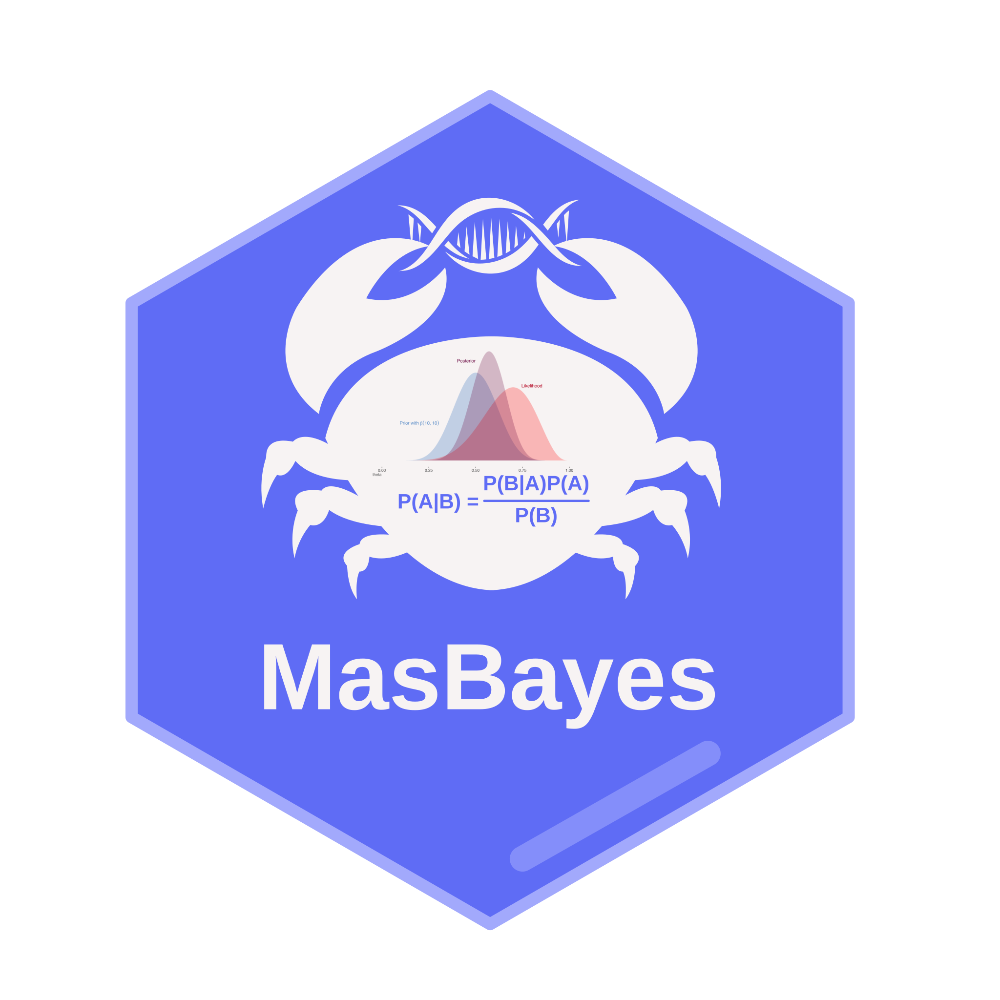

<a id="readme-top"></a>

<p align="center">
  
</p>

<h1 align="center">masbayes</h1>

<p align="center"><em>Bayesian genomic prediction for biallelic SNP and multi-allelic markers</em></p>

<p align="center">
  <a href="LICENSE"></a>
  <a href="https://www.r-project.org/"></a>
  <a href="https://rust-lang.org/"></a>
  <a href="https://bowo1698.github.io/masgenomics-docs/"></a>
</p>

---

## Overview

`masbayes` implements Bayesian genomic prediction (only BayesA and BayesR for now) for both biallelic SNP and multi-allelic (microhaplotype) markers. All numerical computation is handled by a Rust backend via [`extendr`](https://extendr.github.io/) for speed and memory safety. Marginalised Gibbs sampling reduces parameter correlation and accelerates MCMC convergence.

---

## Features

- BayesR (four-class mixture prior) and BayesA (scaled inverse-χ² prior)
- SNP design via `construct_snp_matrix()` and multi-allelic microhaplotype design via `construct_wah_matrix()` (Da 2015 W_αh coding)
- MCMC (marginalised Gibbs) or stochastic EM inference
- Continuous and binary traits (probit link via Albert-Chib data augmentation)
- Optional fixed-effects design matrix `X`
- GWAS: per-allele PIP and per-window WPPA from BayesR posteriors
- S3 methods: `summary()`, `predict()`, `print()`

---

## Part of the masgenomics suite

`masbayes` is one of three packages for end-to-end genomic prediction:

- **[maspipeline](https://github.com/bowo1698/maspipeline)** — preprocessing (phasing → haploblock discovery → microhaplotype genotyping)
- **[masreml](https://github.com/bowo1698/masreml)** — REML-BLUP, GWAS (EMMAX), GWABLUP
- **masbayes** *(this repo)* — Bayesian genomic prediction (BayesA, BayesR)

Full documentation, tutorials, theory, and reference: **<https://bowo1698.github.io/masgenomics-docs/>**

---

## Installation

`masbayes` compiles a Rust backend at install time. Install Rust via [rustup](https://rustup.rs/):

```bash
curl --proto '=https' --tlsv1.2 -sSf https://sh.rustup.rs | sh
```

Then in R:

```r
install.packages(
    "https://github.com/bowo1698/masbayes/archive/refs/heads/main.tar.gz",
    repos = NULL, type = "source"
)
```

Installation details (Linux / macOS / Windows) and troubleshooting are in:
[masgenomics-docs › Installation](https://bowo1698.github.io/masgenomics-docs/installation/).

---

## Quick start

The bundled `load_data()` returns a small demo dataset (n=200, 100 SNPs, 50 MH blocks, h²≈0.5).

### SNP path

```r
library(masbayes)
d <- load_data()

snp_train <- construct_snp_matrix(d$snp[d$train_idx, ], encoding = "vanRaden")
W   <- snp_train$W
y_t <- d$pheno$y_cont_qtl_snp[d$train_idx]

fit_snp <- run_bayesr(
  w             = W,
  y             = y_t,
  wtw_diag      = colSums(W^2),
  sigma2_e_init = var(y_t) * 0.5,
  sigma2_ah     = var(y_t) * 0.5,
  marker_type   = "snp"
)
summary(fit_snp)
```

### Multi-allelic (microhaplotype) path

```r
bid  <- attr(d$mh, "block_id")
wah  <- construct_wah_matrix(d$mh[d$train_idx, ], bid, d$allele_freq, NULL, TRUE)
W_mh <- wah$W_ah
y_h  <- d$pheno$y_cont_qtl_mh[d$train_idx]

fit_mh <- run_bayesr(
  w             = W_mh,
  y             = y_h,
  wtw_diag      = colSums(W_mh^2),
  sigma2_e_init = var(y_h) * 0.5,
  sigma2_ah     = var(y_h) * 0.5,
  marker_type   = "multiallelic"
)
summary(fit_mh)
```

Full tutorials (GP + GWAS, SNP + MH, continuous + binary):
[masgenomics-docs › Tasks](https://bowo1698.github.io/masgenomics-docs/tasks/).

---

## Citation

```bibtex
@software{masbayes,
  author = {Wibowo, Agus},
  title = {masbayes: Bayesian genomic prediction for biallelic SNP and multi-allelic markers},
  url = {https://github.com/bowo1698/masbayes},
  doi = {10.5281/zenodo.20219719},
  year = {2026}
}
```

---

## Development Team

**Lead Developer**

- Agus Wibowo — James Cook University

**Supervisors**

- Prof. Kyall Zenger
- Dr. Cecile Massault
- Dr. Dave Jones

---

## License

[GPL-3](LICENSE) © 2025 Agus Wibowo · Contact: aguswibowo1698@gmail.com

<p align="right"><a href="#readme-top">↑ back to top</a></p>
